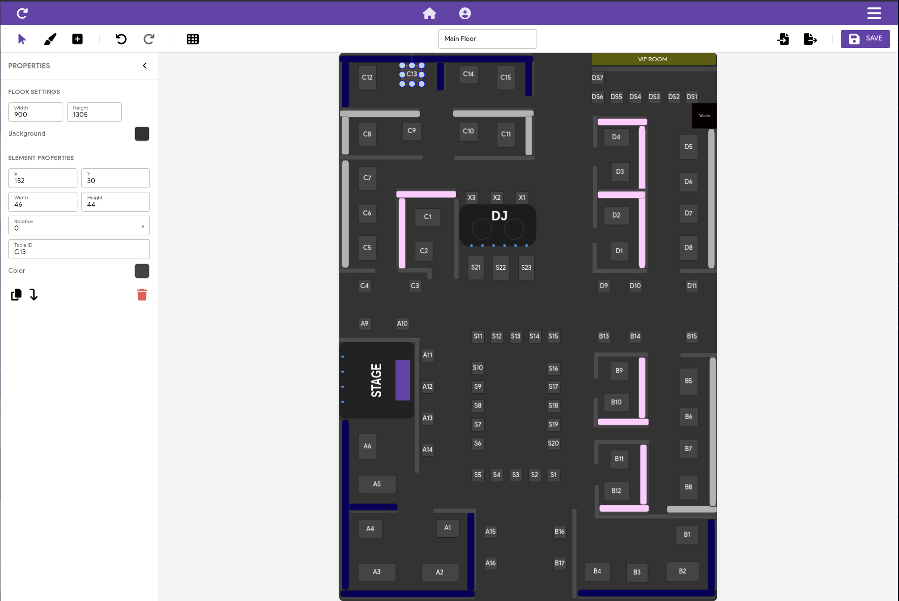

<p align="center">
  
</p>

<h1 align="center">
FIRETABLE
</h1>

[](https://sonarcloud.io/summary/new_code?id=Smrtnyk_Firetable)

Event management system built as a mono-repo using [pnpm](https://pnpm.io/).
Functions as a Progressive Web App (PWA) for desktop-like experience.
Features a powerful custom floor plan editor that allows creating and managing dynamic floor layouts for each property, with the ability to customize plans per event and modify them in real-time.

## Demo
Available at: [https://firetable-eu.web.app](https://firetable-eu.web.app)

Demo credentials:
- Owner: owner@Demo.at / Owner@Demo!234,.
- Staff: staff@Demo.at / Staff@Demo!234,.
- Manager: manager@Demo.at / Manager@Demo!234,.

## Core Features

- Organisation & Property Management
  - Create and manage multiple organisations and their properties
  - Role-based access control for users

- Event Planning
    - Floor plan designer with customizable elements (DJ booths, sofas, tables and much more)
        - Create unique layouts for each property
        - Customize floor plans for specific events
        - Real-time editing and adjustment capabilities
        - Rich selection of venue elements and furnishings
  - Event scheduling and management
  - Guest list creation and management

- Reservation System
  - Handle immediate and wait list reservations
  - Track guest information and visit history
  - Monitor consumption data

- Digital Drink Cards
    - Upload existing drink cards as PDFs
    - Create custom cards using inventory items
    - Generate QR code for easy access
    - Web-hosted for seamless guest access

- Inventory Management
  - Manage inventory items across properties
  - Track stock levels
  - Integrate with digital drink cards

- Analytics
  - Track key metrics for reservations and events
  - Analyze guest patterns and property performance
  - Generate operational insights

- Additional Features
  - Dark mode support
  - Multi-language interface

## Floor Plan Editor

Here’s what the Floor Plan Editor looks like:




## Project Structure

- frontend: Main web application
- functions: Cloud functions
- types: Shared type definitions
- floor-creator: Floor plan creation tool

## Technology Stack

- Frontend: Quasar (Vue.js framework)
- Backend: Firebase + Cloud Functions

## Setup Instructions

1. Install dependencies:
```bash
pnpm install
```

2. Configure Firebase:
   - Copy `/packages/frontend/src/db/fb-config-template.json` in the same directory and rename to `fb-config.json`
   - No need to change anything in `fb-config.json` if you are using Firebase emulators for local development.

3. Run build:
```bash
pnpm run build
```

4. Start development:
   - Firebase emulators: `pnpm run start:emulators`
   - Frontend server: `pnpm run dev:frontend`

The app will be available at `https://localhost:8080`

### HTTPS Setup (Optional)
Generate SSL certificates using `mkcert` for HTTPS mode, or disable it in `quasar.config.js`

### Admin User Setup
Required before first use:
1. Visit Firebase Emulators UI (`http://localhost:3000/auth`)
2. Add new user with custom claim: `{ "role": "Administrator" }`
3. Use these credentials to log in

### Database Seeding
Or rather than starting from scratch and creating admin user manually, you can seed the database with sample data.
For development and testing, you can populate the emulators with sample data:

1. Ensure emulators are running: `pnpm run start:emulators`
2. run one of the seed scripts:
```bash
cd packages/functions
pnpm run seed        # Creates 1 organization without admin user, if already created an admin user
pnpm run seed:admin  # Creates 1 organization with admin user, if you haven't created one yet
```

The seeder supports the following command line arguments:

* `-o`, `--organisations` - Number of organizations to seed (default: 1)
* `-a`, `--with-admin` - Same as previous command, but also creates an admin user
* `-x`, `--only-admin` - Will only create an admin user, no organizations or other users
* `-h`, `--help` - Show help information

When admin user is created, following credentials are available:
* Admin: admin@firetable.at / ADMIN123

This will create:
- Multiple organizations with properties
- Users with various roles (all using password: `USER123`)
- Sample events with floor plans
- Guest data with visit history

The seeding script automatically:
- Creates organization hierarchies
- Assigns properties to organizations
- Sets up users with appropriate roles and permissions
- Generates realistic event data
- Creates guest records with visit history

This makes it easy to start development with a fully populated database instead of an empty state.
To clear the database and start fresh, you have to do it manually in the emulators UI.
Emulators UI provides buttons to clear the database and authentication state.

## Language Support
Currently, it is translated to English, German, Spanish and Croatian languages.

## Contributing
Contributions are welcome! Please take a moment to review our [Contributing Guidelines](CONTRIBUTING.md) and ensure you understand our [Code of Conduct](CODE_OF_CONDUCT.md) before getting started.

## Code of Conduct
By participating in this project, you agree to abide by our [Code of Conduct](CODE_OF_CONDUCT.md), ensuring a respectful and collaborative environment for all contributors.

